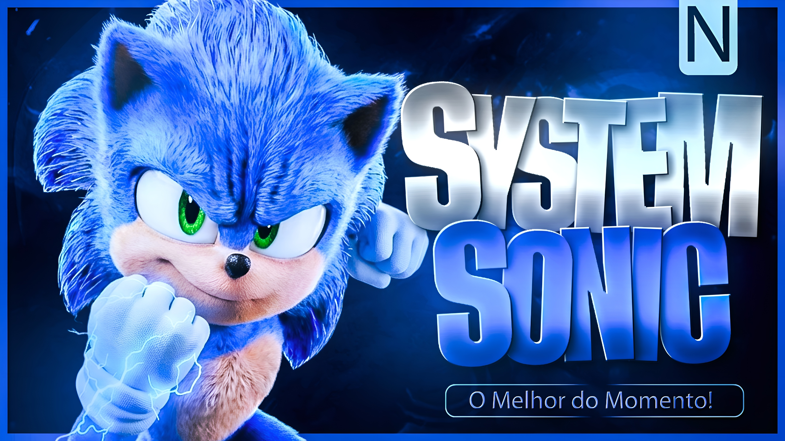

<div align="center">
  
  
  <h1><p align="center"><a href="#"></a></p></h1>
  
  <p align="center">
    
    
    
    
    
  </p>

  ---

  ### O Melhor Bot de WhatsApp do Momento!
  *Segurança, Diversão e Automação em um só lugar.*

</div>

## Sobre o Projeto
O **System Sonic** é um bot de WhatsApp multifuncional desenvolvido para oferecer a melhor experiência em gerenciamento de grupos, entretenimento e ferramentas de utilidade. Esta versão **FREE** oferece a você mais segurança, praticidade e muito mais nos grupos com entretenimento moderado.

## Requisitos de Instalação
Para garantir que o bot funcione corretamente, siga os passos abaixo rigorosamente.

### 1. Atualize o Sistema
```bash
pkg update -y && pkg upgrade -y
```

### 2. Instale o Node.js e Dependências
```bash
pkg install nodejs -y
pkg install git -y
pkg install ffmpeg -y
pkg install imagemagick -y
```

### 3. Instale os Módulos (Obrigatório)
É extremamente importante usar o parâmetro **--legacy-peer-deps** para evitar conflitos de versões:
```bash
npm install --legacy-peer-deps
```

## Como Iniciar
Para ativar o Bot, basta usar o comando **npm start** e configurar tudo pelo console.
```bash
npm start
```

## Funcionalidades Principais

| Categoria | Descrição |
| :--- | :--- |
| **Administração** | Antilink, Antifake, Ban, Promover/Rebaixar, Configuração de Grupos. |
| **Brincadeiras** | Akinator, Jogo da Velha, Comandos de diversão. |
| **Inteligência Artificial** | Integração com Copilot e outras Inteligências Artificiais. |
| **Utilitários** | Download de vídeos/músicas, Stickers (Figurinhas), Pesquisas. |
| **Dono** | Comandos exclusivos para controle total do bot e do sistema de aluguel. |

## Segurança e Ofuscação
Este repositório contém a versão protegida do **System Sonic**. 
- **Control Flow Flattening**: Dificulta a análise lógica.
- **Dead Code Injection**: Adiciona código inútil para confundir ferramentas de desofuscação.
- **String Encryption**: Todas as strings sensíveis estão em Base64/Hexadecimal.
- **Identificadores Únicos**: Variáveis renomeadas para padrões hexadecimais.

## Desenvolvedor
**Ninja Tech </>**
> *"Inovação e Segurança em primeiro lugar."*

---

<div align="center">
  <p>Feito por Ninja Tech</p>
  
</div>
